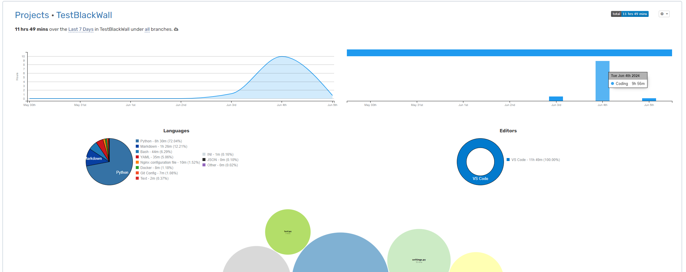

# TestBlackWall

## Info 

> нужны пары BTC/ETH/USDT<->USD
получение данных с Binance нужно реализовать через вебсокеты
по роуту можно получать курсы либо все, либо курсы только одной валютной пары

* Postgres +
* Redis - Есть обёртка, в пару строк, нехватка времени
* FastApi +
* Pydantic +
* Docker - Нехватка времени


## Dependencies

Для запуска вам потребуется Docker, python3.10+ python3-env, PostgreSQL, Redis, Debian-подобная система

> todo Docker compose start file

## Setup

1. Запустим PostgreSQL командой
```shell
sudo docker run --name some-postgres -e POSTGRES_PASSWORD=postgres --restart always -p  5432:5432 -d postgres
```

2. Запустим Redis командой 
```shell
sudo docker run --name some-redis -d --restart always -p  6379:6379 redis redis-server --save  60  1 --loglevel warning
```

3. Настроим окружение и установим зависимости
```shell
python3 -m venv venv
source venv/bin/activate
pip install -r requirements.txt
```

4. Заполним .env файл
```shell
cp example.env .env
nano .env
```

Внутри .env файла будут данные поля:

> todo .env info

> todo Docker compose start file

## Start

Для запуска введите из корня проекта команду

```shell
python src/main.py
```

## Info


Схема базы данных


Затраченное время




## Other (docs copy)

Stream (приходит постоянно новые данные без требования запроса)

https://github.com/binance/binance-spot-api-docs/blob/master/web-socket-streams.md#individual-symbol-book-ticker-streams

https://github.com/binance/binance-spot-api-docs/blob/master/web-socket-streams.md

wss://stream.binance.com:9443/stream?streams=btcusdt@kline_1s
```json 
// real time (real time) Individual Symbol Book Ticker Streams

{
    "stream": "ethusdt@bookTicker",
    "data": {
        "u": 33174183732, // идентификатор обновления ордербука (order book updateId)
        "s": "ETHUSDT", // символ торговой пары (ETH/USDT)
        "b": "3758.13000000", // лучшая цена покупки (best bid price)
        "B": "27.79080000", // количество по лучшей цене покупки (best bid quantity)
        "a": "3758.14000000", // лучшая цена продажи (best ask price)
        "A": "57.19730000" // количество по лучшей цене продажи (best ask quantity)
    }
}


# real time (1000ms) Average price 
{
    "stream": "ethusdt@avgPrice",
    "data": {
        "e": "avgPrice", // Event type
        "E": 1717501600491, // Event time
        "s": "ETHUSDT", // Symbol
        "i": "5m", // Average price interval
        "w": "3760.03887723", // Average price
        "T": 1717501600490 // Last trade time
    }
}
```

-----------

Приходят новые данные по запросу от клиента

Avg Get current average price for a symbol.

https://binance-docs.github.io/apidocs/websocket_api/en/#current-average-price:~:text=Get%20current%20average%20price%20for%20a%20symbol.

Latest price for a symbol or symbols.

https://binance-docs.github.io/apidocs/futures/en/#order-book-2:~:text=%7D%0A%20%20%5D%0A%7D-,Latest%20price%20for%20a%20symbol%20or%20symbols.,-Weight%3A%20*%20with%20symbol

wss://ws-api.binance.com:443/ws-api/v3

```json
// Ticker price
{
  "id": "348baf3a-54fb-4090-abf4-c0c6f7124d9b",
  "status": 200,
  "result": {
    "symbol": "ETHUSDT",
    "price": "3762.15000000"
  },
  "rateLimits": [
    {
      "rateLimitType": "REQUEST_WEIGHT",
      "interval": "MINUTE",
      "intervalNum": 1,
      "limit": 6000,
      "count": 4
    }
  ]
}


// Average price
{
  "id": "e48fe283-edc6-4beb-8b7a-c81a52c61824",
  "status": 200,
  "result": {
    "mins": 5, // Average price interval (in minutes) 
    "price": "3762.95704166", // Average price
    "closeTime": 1717501995769 // Last trade time
  },
  "rateLimits": [
    {
      "rateLimitType": "REQUEST_WEIGHT",
      "interval": "MINUTE",
      "intervalNum": 1,
      "limit": 6000,
      "count": 4
    }
  ]
}
```


